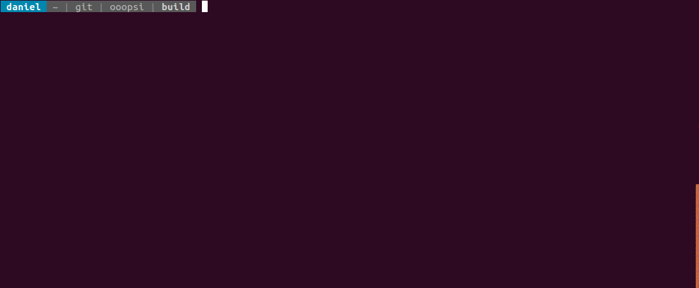

# ooopsi

This library installs C/C++ and OS hooks and handlers for events that would crash your program.
Instead of silently printing a message before terminating or sending a bug report to your OS vendor,
it allows to log a backtrace of the program's current stack and the reason why it terminates.

libooopsi currently catches:

* unhandled C++ exceptions (leading to `std::terminate`)
* segmentation faults
* stack overflows
* illegal instructions
* floating-point errors (e.g. division by zero)
* `std::abort`
* ...

## Where does it log?

By default, the stack trace is logged to STDERR. To override this behavior, use `ooopsi::setAbortLogFunc()` in your program to set a custom logging function. This function will
be called line-wise for every line in the stack trace, followed by a call with a `nullptr`
argument to indicate the end (to allow flushing etc.).

Please be aware that the log function will potentially be called from a signal handler, which
should do only very restrictive things. Make sure to read up on `man signal-safety` (for Linux)
before customizing log function.

## Dependencies and supported platforms

The library needs a C++11 compiler and supports Linux and Windows, both in 64 bit only.

To build the library, you need `libunwind-dev` on Linux and `imagehlp` on Windows as well
as CMake. The unit tests require GoogleTest, which is used as a git submodule.

## How do I include it in my program?

It's sufficient to simply link the shared library against your program. No adaptations are
required. On Linux, it's also possible to use `LD_PRELOAD` to "inject" the library without
having to modify the program at all.

## Where does the name come from?

It's an acronym for:
* Out
* Of
* Options
* Print
* Stack
* Information

Because that's all we can do then ;-)

## License

This project is licensed under the MIT License - see the [LICENSE](LICENSE) file for details.

tl;dr: Feel free to use and modify the code or to include it in your commercial application.
